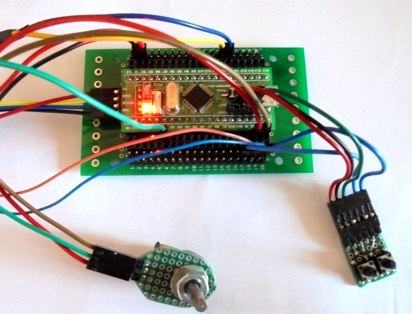
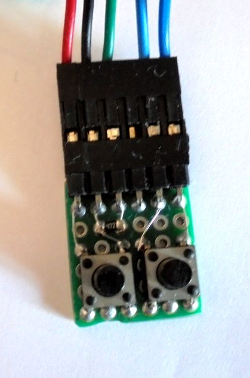
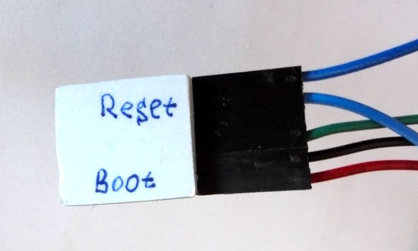
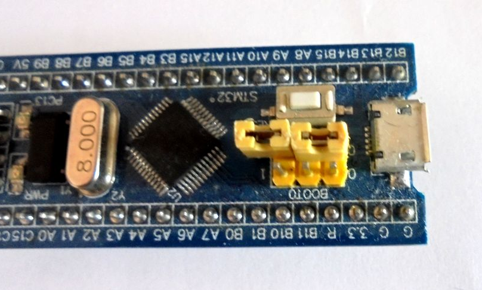
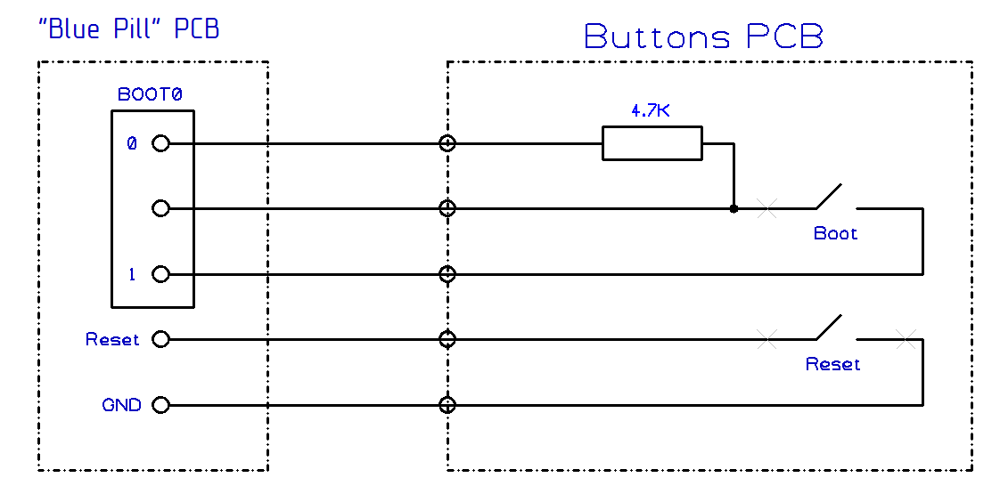

# A small PCB with buttons to switch to download mode via UART

To switch to the download mode "firmware" you can use
jumpers "BOOT0" and the "Reset" button located on the "Blue Pill" board.
But these manipulations are not very convenient.

To do this, you can make buttons from a piece of breadboard:

Both buttons are pressed with one finger.

In order not to lose the jumper, it can be placed on the free pin of the connector BOOT1

Circuit board with buttons and its connection to the "Blue Pill":

