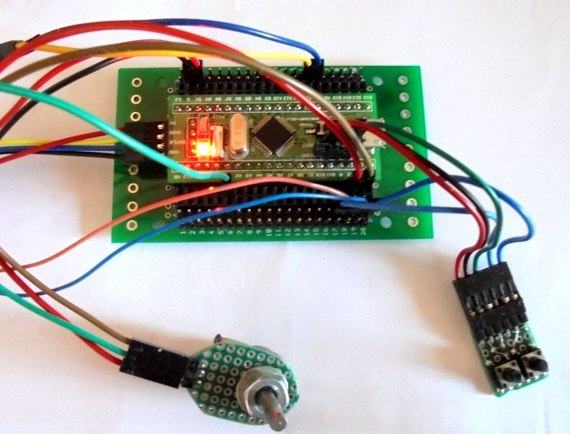
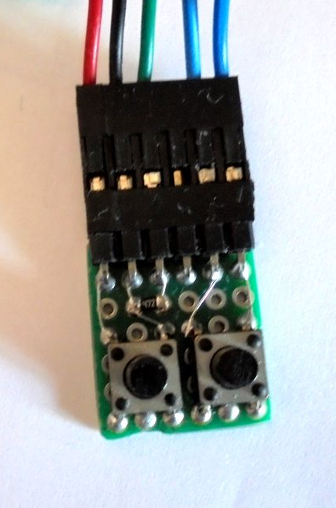
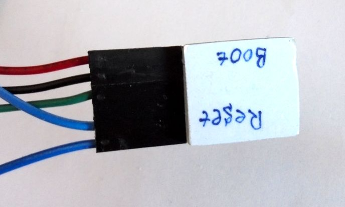
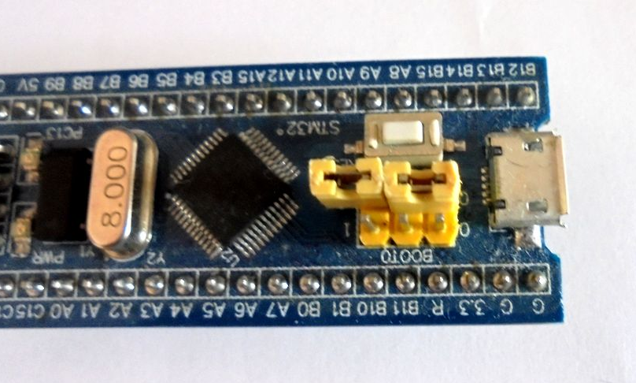
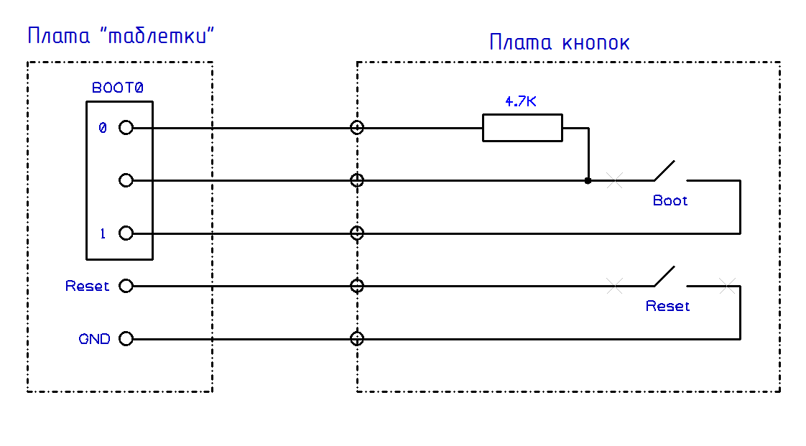

# Небольшая макетная плата с кнопками для переключения в режим загрузки через UART

Для переключения в режим загрузки "прошивки" можно использовать
перемычку BOOT0 и кнопку Reset расположенные на плате "Голубой Таблетки".
Но Данные манипуляции не очень удобны.

Для этого можно из куска макетной платы изготовить кнопки:

Обе кнопки нажимаются одним пальцем.

Чтобы не потерять перемычку, её можно разместить на свободный штырек разъема BOOT1

Схема платы с кнопками и её подключение к "Голубой Таблетке":

