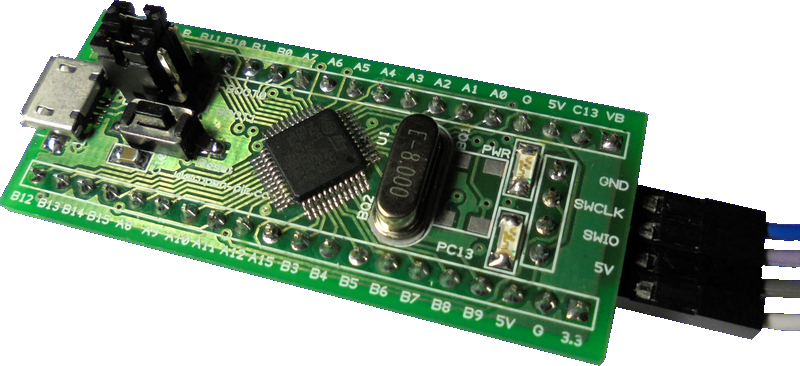

# Green pill
- A small discovery board, like the most popular "Blue Pill" - STM32F103C8T6.
- Can be used as stm32f100, stm32f103, stm32f303 on 48 pins.
- Has three differences versus "Blue Pill" in pinout.

